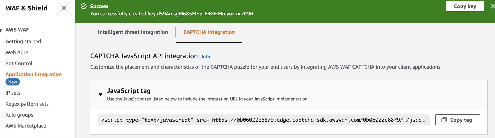
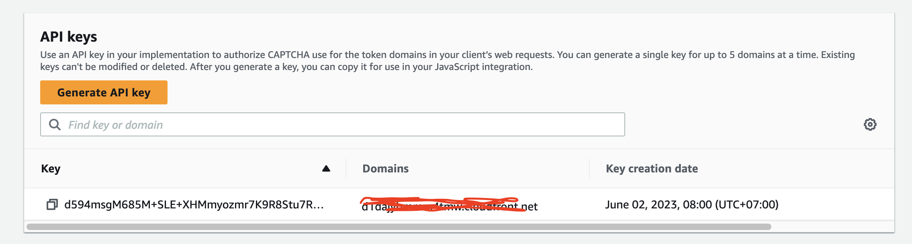

#WEBSITE CLIENT WITH AWS CAPTCHA INTEGRATION


**Get your waf js integration url and declare it**

```html
    <script type="text/javascript" src="<get from waf captcha integration>" defer></script>
```

**Get the api key for your domain at the same page as above** 
Ex: yourdomain.com

```js
      AwsWafCaptcha.renderCaptcha(container, {
        apiKey: "<get from captcha integration>",
        onSuccess: captchaExampleSuccessFunction,
        onError: captchaExampleErrorFunction,
      });
```

**Then handle client call to protected url by waf**
```js
    function captchaExampleSuccessFunction(wafToken) {
      // Captcha completed. wafToken contains a valid WAF token. Store it for
      // use later or call AwsWafIntegration.fetch() to use it easily.
      // It will expire after a time, so calling AwsWafIntegration.getToken()
      // again is advised if the token is needed later on, outside of using the
      // fetch wrapper.

      // Use WAF token to access protected resources
      console.log("waf token", wafToken);
      AwsWafIntegration.fetch(
        "<get from website domain name",
        {
          method: "GET",
        }
      )
        .then((e) => console.log("fetch ok"))
        .catch((e) => console.log("fetch fail"));
      console.log("captcha success");
    }
```

**reference**
https://d1dajybmmm4tmw.cloudfront.net/index.html

**flow**
client -> https://d1dajybmmm4tmw.cloudfront.net/index.html -> captcha appear (based on integrated js) -> finish captcha -> fetch https://d1dajybmmm4tmw.cloudfront.net/test (protected url by waf) -> 200 ok -> check network chrome -> json data response 
```json
{
  "value" : "quang"
}
```

**architect**

client -> Cloudfront static website (s3) -> Cloudfront origin api gateway 
WAF -> web acl -> own rule -> scope down with match statement using uri path "/test" -> action CAPTCHA
